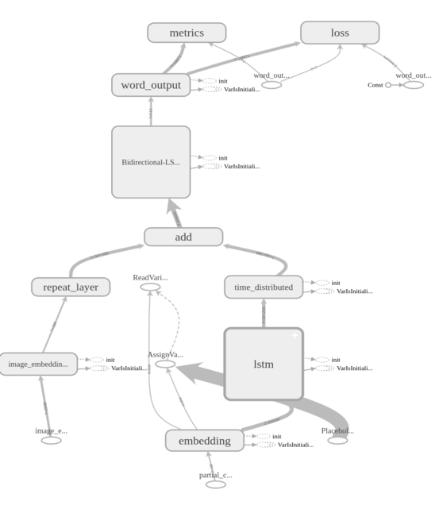
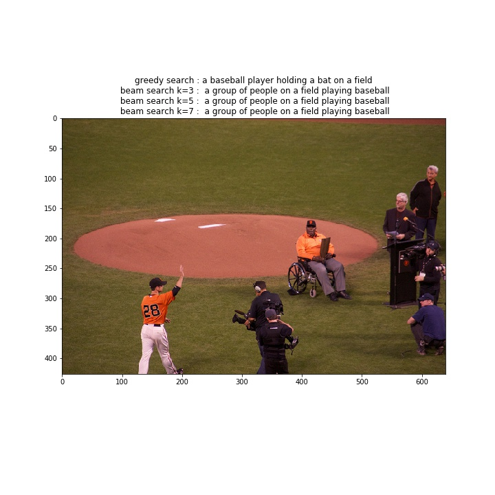
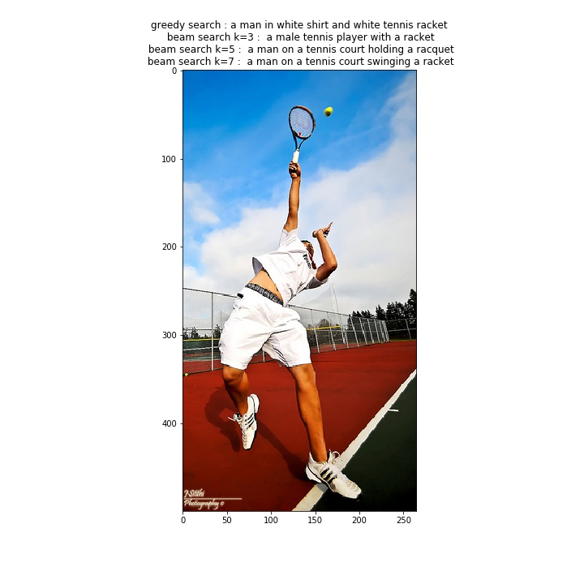
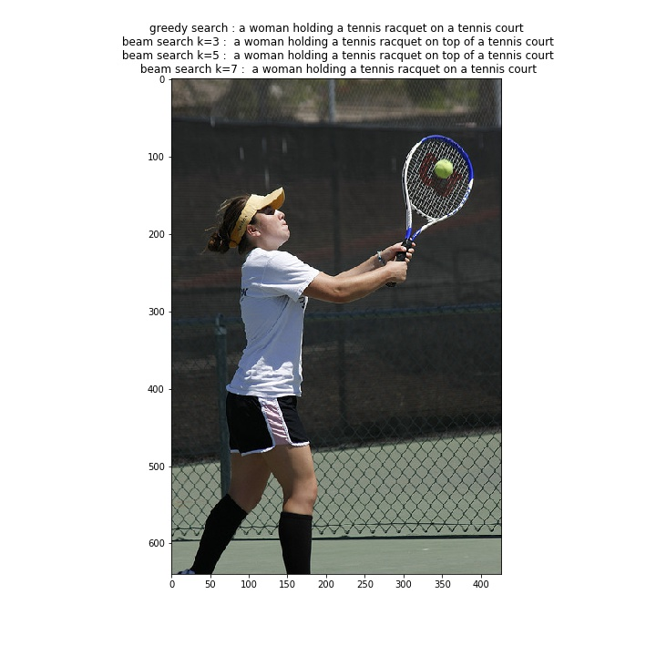
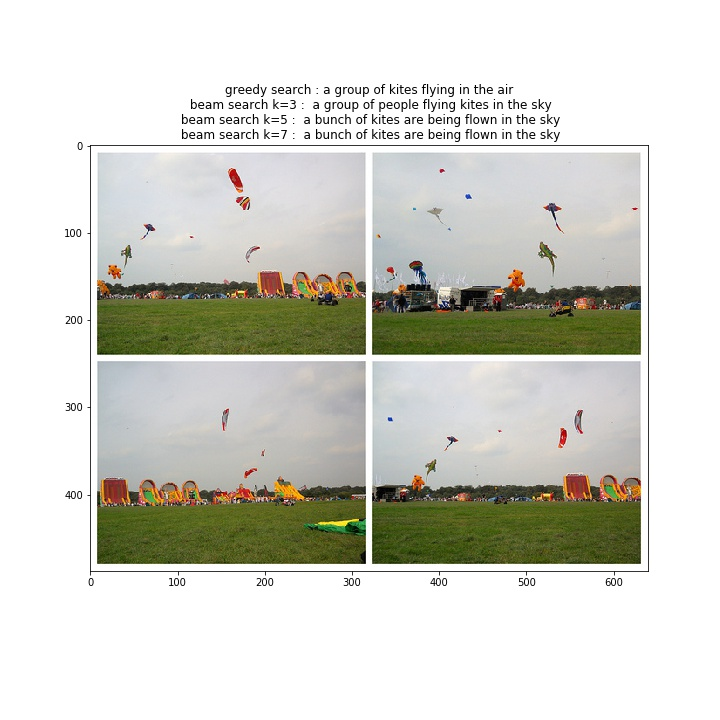
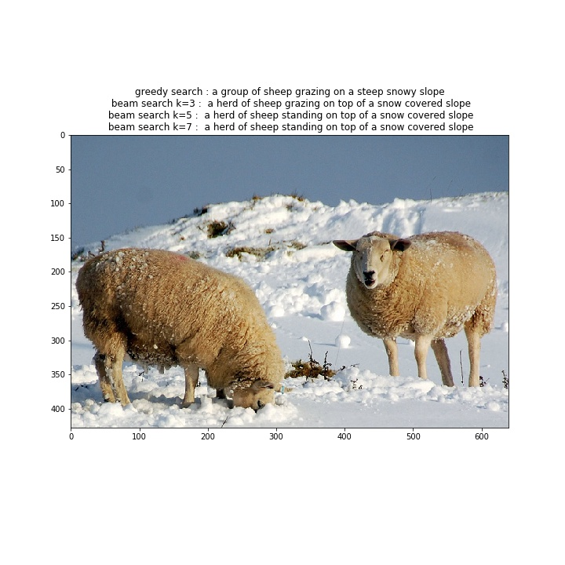
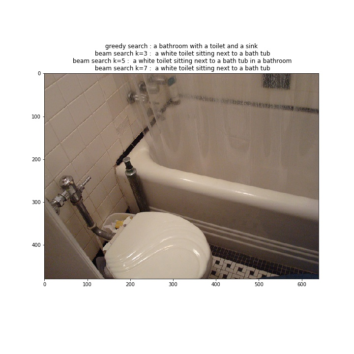
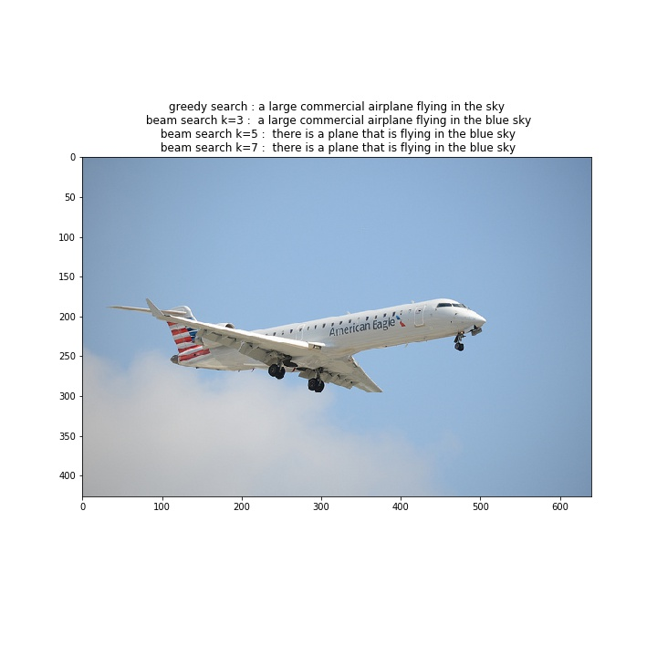
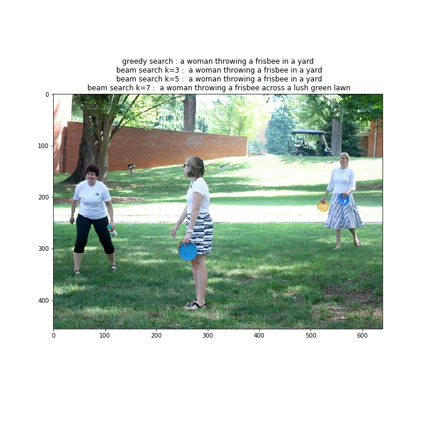
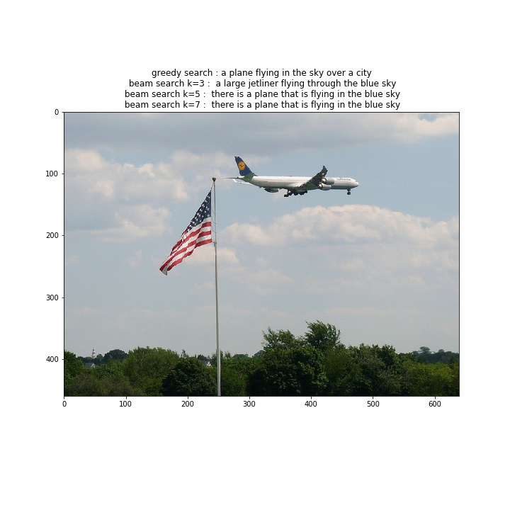

Download pretrained weights [here](https://drive.google.com/file/d/1oEH6-Hm7jehaPu0y-LlD-AJuF3zccw9Z/view?usp=sharing)
# Model architecture
The model consists of 3 submodels :
 - Xception network (initialized with imagenet weights) as feature extractor, which provides the context vector
 - A language model (embedding layer initialized with pretrained GloVe weights) which functions as an encoder
 - A decoder network with BiDirectional LSTM layers to produce one word at a time using the partional captions from the encoder and the context vector from the image model
 - Final outputs are generated either by performing beam search, or going greedy 

# Training 
- All the images from the dataset are passed through the image model and the outputs are stored to reduce the training time. This is done by feeding in the precomputed image embeddings during training rather than passing the image through the image model each epoch
- The model converges with a loss crossentropy_loss of 2.33 after training for about 5 epochs with lr=1e-4 and Adam optimizer
- Further improvement can been achieved by unfreezing the image model and training end to end

# Results

# To-do
 - [ ] Train the entire model end to end
 - [ ] Experiment with attention layers and Gated Recurrent Units
